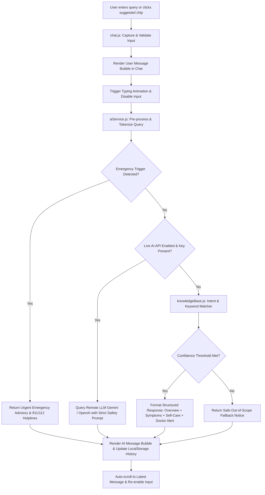

# HealthAI — AI-Based Health Information Chatbot

> **Academic Final-Year / Semester College Project**  
> An educational, responsive healthcare information web application designed to promote health awareness, provide symptom education, suggest self-care measures, and guide users to qualified medical professionals.

---

## 📌 1. Project Overview

- **Project Title:** AI-Based Health Information Chatbot
- **Application Name:** HealthAI
- **Category:** Healthcare Informatics / Conversational AI Prototype
- **Target Audience:** College Students, General Public, Health Literacy Demonstrations
- **Core Principle:** **Educational & Informational Only — NOT a Medical Diagnosis System.**

---

## 🎯 2. Problem Statement & Proposed Solution

### Problem Statement
In the digital age, individuals frequently experience mild symptoms and turn to generic web search engines. This often exposes them to alarmist diagnoses, confusing medical terminology, unverified home remedies, and dangerous health advice. Furthermore, patients often do not know when a symptom is harmless or when it represents a red flag requiring immediate clinical evaluation.

### Proposed Solution
**HealthAI** provides a controlled, accessible, and safe conversational interface. It classifies common health inquiries across 11 key wellness categories and returns structured, plain-language guidance comprising:
1. **General Overview** (demystifying the condition).
2. **Common Signs & Symptoms** (educational awareness).
3. **Evidence-Based Self-Care** (hydration, rest, nutrition).
4. **When to Seek Professional Medical Help** (explicit red-flag warnings).

---

## 🎯 3. Project Objectives

1. **Provide quick access to general health information:** Deliver immediate, 24/7 informational answers to common health inquiries without account barriers.
2. **Make health information easier to understand:** Translate complex clinical terminology into clear, accessible language.
3. **Answer frequently asked health-related questions:** Address common queries relating to cough, cold, fever, headaches, hydration, sleep, and first aid.
4. **Promote healthy habits and preventive awareness:** Foster proactive lifestyle habits like hydration discipline, sleep hygiene, balanced nutrition, and exercise.
5. **Encourage users to seek professional medical advice when necessary:** Explicitly remind users of system limitations and provide clear guidance on consulting licensed healthcare professionals.

---

## ⚙️ 4. System Architecture & Flow



---

## 📂 5. Folder & File Structure

```
project ai/
│
├── index.html                 # Main single-page web app with landing page & chatbot studio
├── README.md                  # Complete college project report & viva guide
│
├── css/
│   ├── style.css              # Global design system, typography, hero, cards, responsive layout
│   └── chat.css               # Chat studio styles, message bubbles, typing animation, chips
│
├── js/
│   ├── knowledgeBase.js       # Curated health educational dataset (11 categories)
│   ├── aiService.js           # Smart keyword/intent matching & real AI API connector
│   ├── chat.js                # Chat controller (state, localStorage, typing latency, chips)
│   └── app.js                 # Global interactions, sticky header, mobile hamburger drawer
```

---

## 🩺 6. Knowledge Base Categories

The built-in offline engine covers 11 major wellness categories:
1. **Common Cold:** Upper respiratory viral awareness, hydration, saline rinses.
2. **Fever:** Temperature thresholds, sponge compresses, hydration, pediatric cautions.
3. **Headache:** Tension headaches, dehydration triggers, screen strain relief, 20-20-20 rule.
4. **Cough:** Dry vs. productive coughs, warm honey tea cautions, humidity.
5. **Dehydration:** Dark urine indicators, electrolyte balance, oral rehydration solutions.
6. **Sleep:** Sleep hygiene, circadian rhythm, blue light management, wind-down rituals.
7. **Exercise:** Aerobic standards (150 min/wk), warm-ups, strength training, cardiovascular cautions.
8. **Healthy Eating:** Plate balance, whole grains, lean proteins, ultra-processed food limits.
9. **Mental Wellness:** Stress reduction, diaphragmatic breathing, digital boundaries, crisis lines.
10. **First-Aid & General Safety:** Minor cuts, 1st-degree burns (running cool water), R.I.C.E. for sprains.
11. **Preventive Healthcare:** Routine screenings, blood pressure checks, immunizations, and annual physicals.

---

## 🚀 7. How to Run Locally

### Method 1: Instant Zero-Install (Recommended for College Presentations)
Because this project is built using native **HTML5, Modern CSS3, and Modular ES6 JavaScript**, it requires **zero installations or terminal commands**:
1. Open the project folder: `c:\Users\velmu\Desktop\project ai\`
2. Double-click **`index.html`** in File Explorer.
3. The website and chatbot will immediately open and run in any web browser (Google Chrome, Microsoft Edge, Mozilla Firefox, Brave, Safari).

### Method 2: Running with VS Code Live Server
1. Open the `project ai` folder in **Visual Studio Code**.
2. Install the **"Live Server"** extension (by Ritwick Dey).
3. Right-click `index.html` and click **"Open with Live Server"**.
4. The site will launch on `http://127.0.0.1:5500`.

### Method 3: Running with Python Local Server (if Python is installed)
```bash
# In the project directory:
python -m http.server 8000
# Visit http://localhost:8000 in your browser
```

---

## 🔌 8. How to Connect a Real AI API (Optional Upgrade)

The project is already architected with a decoupled service layer (`js/aiService.js`). To switch from the offline knowledge base to a live AI model:

### Connecting Google Gemini (Free Tier Available):
1. Obtain a free API key from [Google AI Studio](https://aistudio.google.com/).
2. Open [`js/aiService.js`](file:///c:/Users/velmu/Desktop/project%20ai/js/aiService.js).
3. Update the `CONFIG` block:
   ```javascript
   const CONFIG = {
     USE_REAL_AI: true,          // Change from false to true
     PROVIDER: "gemini",         // "gemini" or "openai"
     API_KEY: "YOUR_GEMINI_API_KEY_HERE",
     // ...
   };
   ```
4. Save the file and refresh `index.html`. Your queries will now be answered by Google Gemini with the injected medical safety prompt!

### Connecting OpenAI (ChatGPT):
1. Obtain an API key from [OpenAI Platform](https://platform.openai.com/).
2. In `js/aiService.js`, set `PROVIDER: "openai"` and insert your key in `API_KEY`.

---

## 🚢 9. Building and Deploying to the Web

Because the project uses standard web technologies with no compilation required, you can deploy it for free in under 2 minutes:

### Deploying to GitHub Pages:
1. Push this folder to a GitHub repository.
2. Go to **Settings > Pages**.
3. Under **Branch**, select `main` and root `/`, then click **Save**.
4. Your site will be live at `https://<your-username>.github.io/<repo-name>/`.

### Deploying to Netlify or Vercel:
1. Drag and drop the `project ai` folder directly into the [Netlify Drop](https://app.netlify.com/drop) dashboard.
2. Netlify will instantly provide a live HTTPS URL for your college presentation.

---

## ⚠️ 10. Medical Disclaimer & Limitations

### Official Disclaimer
> “This chatbot provides general health information for educational purposes only. It does not provide medical diagnosis, treatment, or professional medical advice. Always consult a qualified healthcare professional for medical concerns. In an emergency, contact your local emergency services.”

### System Limitations
1. **No Diagnostic Capability:** Cannot interpret complex medical histories, lab blood tests, or radiology scans.
2. **No Prescription Authority:** Never advises on pharmaceutical drug dosages or prescription medication.
3. **No Emergency Triage:** Not integrated with real-time hospital dispatch or emergency services.

---

## 🎓 11. Sample College Viva / Oral Exam Q&A

**Q1: Why did you choose this technology stack over a heavy framework like React?**  
*Answer:* For this educational prototype, pure modern HTML5, CSS3, and ES6 JavaScript were selected to ensure zero-overhead, instant load times, seamless offline demonstration, and full compatibility across any client device without complex build tool dependencies. However, the code is structured modularly with clear separation of concerns (Model: `knowledgeBase.js`, Controller: `aiService.js` and `chat.js`, View: `index.html` and `style.css`), which allows easy migration to React/Vite if desired.

**Q2: How does the offline chatbot process natural language queries?**  
*Answer:* The engine tokenizes the user's sentence, strips punctuation, and calculates keyword match scores across weighted category entries. It checks for critical red-flag emergency keywords first (e.g., chest pain, breathing difficulties), before matching the highest-confidence category and rendering a structured, educational four-part answer.

**Q3: How do you prevent the AI from giving dangerous medical advice?**  
*Answer:* Safety is built into the architecture at three layers:
1. **Curated Output Templates:** Offline responses are strictly non-prescriptive, emphasizing self-care and medical consultation.
2. **Emergency Triage Guard:** Queries mentioning acute symptoms trigger immediate emergency telephone directives.
3. **Remote System Prompt Injections:** If a live LLM is connected, a system prompt explicitly forbids medical diagnosis, prescriptions, or claims of replacing a doctor.
